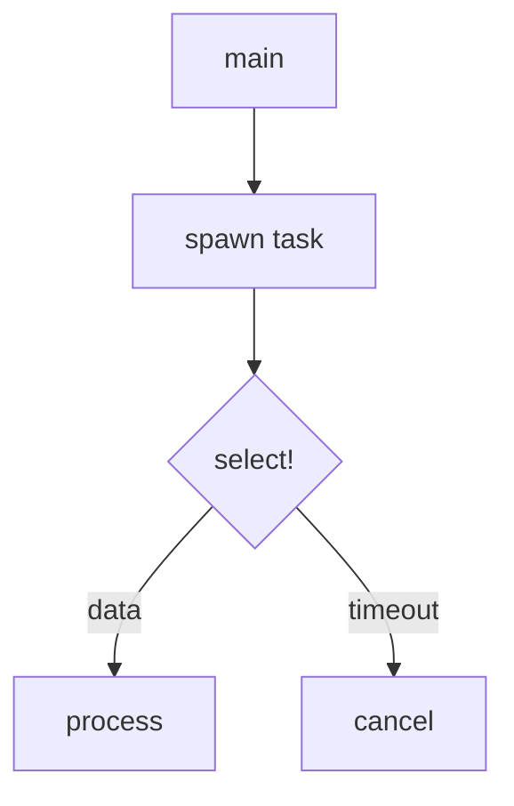

# Microsoft RustTraining

> Skill by [ara.so](https://ara.so) — Daily 2026 Skills collection.

Seven mdBook-based Rust training courses covering beginner through expert levels, with Mermaid diagrams, interactive playgrounds, and exercises. Books range from language-bridge guides (C/C++, C#, Python) to deep dives on async, advanced patterns, type-driven correctness, and engineering practices.

---

## What This Project Provides

| Book | Level | Focus |
|------|-------|-------|
| `c-cpp-book` | 🟢 Bridge | RAII, FFI, no_std, embedded |
| `csharp-book` | 🟢 Bridge | Ownership from OOP perspective |
| `python-book` | 🟢 Bridge | Dynamic → static typing, concurrency |
| `async-book` | 🔵 Deep Dive | Tokio, streams, cancellation safety |
| `rust-patterns-book` | 🟡 Advanced | Pin, allocators, lock-free, unsafe |
| `type-driven-correctness-book` | 🟣 Expert | Type-state, phantom types, capabilities |
| `engineering-book` | 🟤 Practices | CI/CD, cross-compilation, Miri, build scripts |

---

## Installation & Setup

### Prerequisites

```bash
# Install Rust via rustup
curl --proto '=https' --tlsv1.2 -sSf https://sh.rustup.rs | sh

# Install mdbook and the Mermaid preprocessor
cargo install mdbook mdbook-mermaid
```

### Clone the Repo

```bash
git clone https://github.com/microsoft/RustTraining.git
cd RustTraining
```

---

## Key Commands

### xtask (Build All Books)

The project uses a Cargo xtask pattern for orchestrating all books at once:

```bash
# Build all books into site/ for local preview
cargo xtask build

# Build and serve all books at http://localhost:3000
cargo xtask serve

# Build into docs/ for GitHub Pages deployment
cargo xtask deploy

# Remove site/ and docs/ directories
cargo xtask clean
```

### Single Book (mdbook directly)

```bash
# Serve a specific book with live-reload
cd async-book && mdbook serve --open         # http://localhost:3000
cd rust-patterns-book && mdbook serve --open
cd type-driven-correctness-book && mdbook serve --open

# Build a single book without serving
cd c-cpp-book && mdbook build
# Output goes to c-cpp-book/book/
```

### Reading on GitHub

Each book's table of contents is at `<book-dir>/src/SUMMARY.md`:
- `c-cpp-book/src/SUMMARY.md`
- `async-book/src/SUMMARY.md`
- `engineering-book/src/SUMMARY.md`
- etc.

---

## Repository Structure

```
RustTraining/
├── xtask/                        # Build orchestration (cargo xtask)
│   └── src/main.rs
├── c-cpp-book/
│   ├── book.toml                 # mdBook config
│   └── src/
│       ├── SUMMARY.md            # Table of contents
│       └── *.md                  # Chapter files
├── csharp-book/
├── python-book/
├── async-book/
├── rust-patterns-book/
├── type-driven-correctness-book/
├── engineering-book/
├── site/                         # Local preview output (gitignored)
├── docs/                         # GitHub Pages output
└── Cargo.toml                    # Workspace root
```

### book.toml Structure (per book)

```toml
[book]
title = "Async Rust"
authors = ["Microsoft"]
language = "en"
src = "src"

[preprocessor.mermaid]
command = "mdbook-mermaid"

[output.html]
additional-css = ["custom.css"]
```

---

## Code Patterns from the Books

### Ownership & Borrowing (Bridge Books)

```rust
// Ownership transfer — key concept from c-cpp-book / csharp-book
fn take_ownership(s: String) -> String {
    println!("Got: {s}");
    s  // move back to caller
}

fn borrow(s: &str) {
    println!("Borrowed: {s}");
}

fn main() {
    let s = String::from("hello");
    borrow(&s);               // s still valid
    let s2 = take_ownership(s); // s moved, s2 owns it
}
```

### Async / Tokio (async-book)

```rust
use tokio::time::{sleep, Duration};

#[tokio::main]
async fn main() {
    let result = tokio::select! {
        val = fetch_data() => format!("data: {val}"),
        _ = sleep(Duration::from_secs(5)) => "timeout".to_string(),
    };
    println!("{result}");
}

async fn fetch_data() -> u32 {
    sleep(Duration::from_secs(1)).await;
    42
}
```

### Cancellation-Safe Streams (async-book)

```rust
use tokio_stream::{StreamExt, wrappers::ReceiverStream};
use tokio::sync::mpsc;

async fn process_stream() {
    let (tx, rx) = mpsc::channel::<u32>(32);
    let mut stream = ReceiverStream::new(rx);

    tokio::spawn(async move {
        for i in 0..10 {
            tx.send(i).await.unwrap();
        }
    });

    while let Some(item) = stream.next().await {
        println!("item: {item}");
    }
}
```

### Type-State Pattern (type-driven-correctness-book)

```rust
use std::marker::PhantomData;

struct Locked;
struct Unlocked;

struct Vault<State> {
    secret: String,
    _state: PhantomData<State>,
}

impl Vault<Locked> {
    pub fn new(secret: impl Into<String>) -> Self {
        Vault { secret: secret.into(), _state: PhantomData }
    }
    pub fn unlock(self, key: &str) -> Result<Vault<Unlocked>, &'static str> {
        if key == "correct" {
            Ok(Vault { secret: self.secret, _state: PhantomData })
        } else {
            Err("wrong key")
        }
    }
}

impl Vault<Unlocked> {
    pub fn read(&self) -> &str {
        &self.secret
    }
    pub fn lock(self) -> Vault<Locked> {
        Vault { secret: self.secret, _state: PhantomData }
    }
}

fn main() {
    let vault = Vault::<Locked>::new("top secret");
    // vault.read(); // compile error — cannot call read() on Locked vault
    let open = vault.unlock("correct").unwrap();
    println!("{}", open.read());
    let _locked_again = open.lock();
}
```

### Phantom Types for Units (type-driven-correctness-book)

```rust
use std::marker::PhantomData;

struct Meters;
struct Feet;

#[derive(Debug, Clone, Copy)]
struct Distance<Unit> {
    value: f64,
    _unit: PhantomData<Unit>,
}

impl Distance<Meters> {
    pub fn meters(v: f64) -> Self { Distance { value: v, _unit: PhantomData } }
    pub fn to_feet(self) -> Distance<Feet> {
        Distance { value: self.value * 3.28084, _unit: PhantomData }
    }
}

impl Distance<Feet> {
    pub fn feet(v: f64) -> Self { Distance { value: v, _unit: PhantomData } }
}

fn main() {
    let d = Distance::<Meters>::meters(100.0);
    let f = d.to_feet();
    println!("{:.2} feet", f.value);
    // Distance::<Meters>::meters(1.0) + Distance::<Feet>::feet(1.0) // compile error
}
```

### Pin & Self-Referential Structs (rust-patterns-book)

```rust
use std::pin::Pin;
use std::marker::PhantomPinned;

struct SelfRef {
    value: String,
    ptr: *const String,  // points into `value`
    _pin: PhantomPinned,
}

impl SelfRef {
    pub fn new(v: impl Into<String>) -> Pin<Box<Self>> {
        let s = SelfRef {
            value: v.into(),
            ptr: std::ptr::null(),
            _pin: PhantomPinned,
        };
        let mut boxed = Box::pin(s);
        let ptr: *const String = &boxed.value;
        // SAFETY: we are only setting the pointer, not moving the struct
        unsafe { boxed.as_mut().get_unchecked_mut().ptr = ptr; }
        boxed
    }

    pub fn get_value(self: Pin<&Self>) -> &str {
        // SAFETY: ptr was set from value's address, struct is pinned
        unsafe { &*self.ptr }
    }
}
```

### Custom Allocator (rust-patterns-book)

```rust
use std::alloc::{GlobalAlloc, Layout, System};
use std::sync::atomic::{AtomicUsize, Ordering};

struct TrackingAllocator;
static ALLOCATED: AtomicUsize = AtomicUsize::new(0);

unsafe impl GlobalAlloc for TrackingAllocator {
    unsafe fn alloc(&self, layout: Layout) -> *mut u8 {
        let ptr = System.alloc(layout);
        if !ptr.is_null() {
            ALLOCATED.fetch_add(layout.size(), Ordering::Relaxed);
        }
        ptr
    }
    unsafe fn dealloc(&self, ptr: *mut u8, layout: Layout) {
        System.dealloc(ptr, layout);
        ALLOCATED.fetch_sub(layout.size(), Ordering::Relaxed);
    }
}

#[global_allocator]
static A: TrackingAllocator = TrackingAllocator;

fn main() {
    let _v: Vec<u8> = vec![0u8; 1024];
    println!("Currently allocated: {} bytes", ALLOCATED.load(Ordering::Relaxed));
}
```

### FFI Example (c-cpp-book)

```rust
// Calling a C function from Rust
extern "C" {
    fn abs(x: i32) -> i32;
    fn strlen(s: *const std::ffi::c_char) -> usize;
}

fn main() {
    let result = unsafe { abs(-42) };
    println!("abs(-42) = {result}");

    let s = std::ffi::CString::new("hello").unwrap();
    let len = unsafe { strlen(s.as_ptr()) };
    println!("strlen = {len}");
}
```

### Build Script Pattern (engineering-book)

```rust
// build.rs — runs before compilation
fn main() {
    // Re-run if C source changes
    println!("cargo:rerun-if-changed=src/native/helper.c");

    // Link a system library
    println!("cargo:rustc-link-lib=z");  // zlib

    // Pass compile-time env var
    let profile = std::env::var("PROFILE").unwrap_or_default();
    println!("cargo:rustc-env=BUILD_PROFILE={profile}");

    // Compile C code with cc crate
    cc::Build::new()
        .file("src/native/helper.c")
        .compile("helper");
}
```

---

## Adding Content to a Book

### New Chapter

1. Create `<book-dir>/src/chapter-name.md`
2. Register it in `<book-dir>/src/SUMMARY.md`:

```markdown
# Summary

- [Introduction](./introduction.md)
- [My New Chapter](./chapter-name.md)
  - [Subsection](./chapter-name-sub.md)
```

### Mermaid Diagram in Markdown

````markdown

````

### Rust Playground Link

```markdown
You can run this example in the [Rust Playground](https://play.rust-lang.org/?code=fn+main()+%7B+println!(%22hello%22);+%7D).
```

---

## Troubleshooting

### `cargo xtask serve` fails — port in use

```bash
# Kill whatever is on 3000
lsof -ti:3000 | xargs kill -9
cargo xtask serve
```

### `mdbook-mermaid` not found

```bash
cargo install mdbook-mermaid
# Ensure ~/.cargo/bin is in PATH
export PATH="$HOME/.cargo/bin:$PATH"
```

### Book renders but diagrams are blank

Ensure `mdbook-mermaid` preprocessor is in `book.toml`:

```toml
[preprocessor.mermaid]
command = "mdbook-mermaid"
```

And run `mdbook-mermaid install` inside the book directory:

```bash
cd async-book
mdbook-mermaid install
mdbook serve
```

### Search not working locally

Search requires the book to be served (not opened as a file). Use `mdbook serve`, not opening `book/index.html` directly.

### Rust examples in book don't compile

Check the code fence annotation:

````markdown
```rust
// compiled and tested by `mdbook test`
```

```rust,ignore
// skipped during mdbook test
```

```rust,no_run
// compiled but not executed
```
````

Run tests for a book:

```bash
cd async-book && mdbook test
```

---

## GitHub Pages Deployment

The repo auto-deploys via `.github/workflows/pages.yml` on push to `master`. To deploy manually:

```bash
cargo xtask deploy   # outputs to docs/
git add docs/
git commit -m "deploy: rebuild books"
git push origin master
```

Ensure GitHub Pages is set to serve from the `docs/` folder in repository Settings → Pages.

---

## Learning Path Recommendations

**Coming from C/C++:** `c-cpp-book` → `rust-patterns-book` → `async-book`

**Coming from Python/JS:** `python-book` → `async-book` → `engineering-book`

**Coming from C#/Java:** `csharp-book` → `type-driven-correctness-book` → `rust-patterns-book`

**Systems/embedded:** `c-cpp-book` (no_std chapters) → `rust-patterns-book` (allocators, unsafe)

**Production services:** `async-book` → `engineering-book` → `rust-patterns-book`
